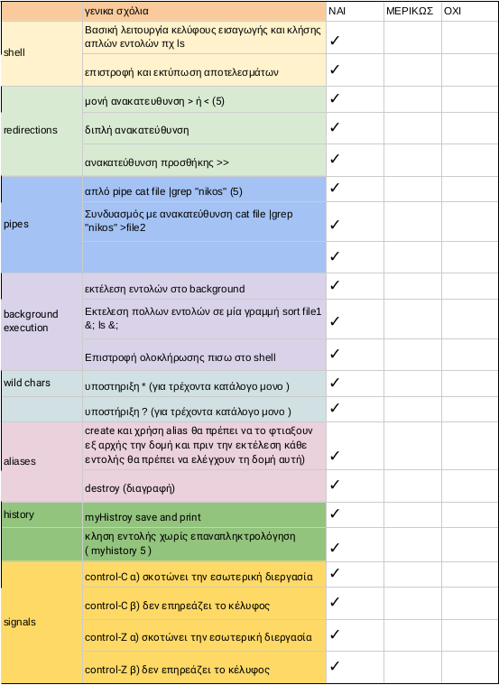

System Programming Course -- Assignment I\
April 2023\
Author : Yannis Zervakis
## Abstract :
    In this project we are trying to build a shell, that gets commands, parses them and executes them. First of all we had to make a parser that parses simple commands with : arguments, I/O redirection, pipeline, background character. After the parser's building, for each command the goal was to call an exec* function for executing the command, connect pipes for pipelining, handle signals (^C, ^Z), etc.

### Parser :  
The first part of the project was to make a parser which can recognize simple commands. In order to build that parser, we created the following grammar :

    Command <- <identifier> Args InputFile OutputFile Pipeline Background
    Args <- <identifier> Args | ε
    InputFile <- < <identifier> | ε
    Outputfile -> > <identifier> | >> <identifier> | ε
    Pipeline -> '|' Command | ε
    Background -> & | ε

So, parser class is the type of Parser objects, who are recursive descent parsers following the grammar above. Parser scans the input stream character by character (lookahead), and stores a number of commands in a list that belongs to a pipeline (if there isn't pipeline, size of the list is equal to 1). For parsing command from input stream, we only have to call parse_command routine, which calls all the corresponding rules-routines of grammar to recognize the given command.

### a) Commands with redirection :
For redirection's implementation we just parse the input/output file, open it (in reading or writing mode) and connect the file descriptors for each command (by using dup2 function and closing the right file descriptors for stdin or stdout)

### b) Commands in pipeline :
In order to implement the pipeline in our shell, we firstly keep all the commands of the pipeline in a list as a private member of a Parser object. We traverse all the commands and connect the pipe's ends for each one. The first takes input from stdin and the last's output is stdout. Between the first and the last command we connect the left command's output to the right command's input using two temporary arrays of integers to hold the pipes. After the connections we close the streams of pipes that we connected.

### c) Run commands in background :
In order to implement backgrounds commands, we used group process and job control. First of all we parse the background command and we check if the character '&' was given. We create a process group for the shell identifying it by the pid of process itself and connect the the terminal to it (by connecting the stdin using tcsetpgrp command). For each group of commands of a pipeline we create a group of processes identifying it by the pid of the first process-command. If the pipeline is in foreground we connect temporarily the terminal to the current group of processes (by connecting the stdin using tcsetpgrp command again). On another hand, if the pipeline is in background we don't do that connection in order to make sure that there is no way to let the current group "steal" input of the next command. After the execution of all commands in the pipeline we return the terminal to parent process-shell (by using again tcsetpgrp command).

### d) Support wild characters :
For supporting wild characters we used glob function in parsing level, which is finds pathnames matching a pattern.

### e) Handle aliases :
In order to have the feature of aliases we use a map that maps the name of alias with the given command. To create an alias we have to type the command `createalias name_of_alias command` and to destroy it we have to type the command `destroyalias name_of_alias`. When an alias is given to execute the corresponding command, we temporarily change the input stream of the next parser into a intermediate stream that contains the command which is mapped to the alias and we skip all sections until we reach the parsing level.

### f) Handle signals :
By using process groups the handling of signals becomes very easy. We just ignore (`ignore_signal` signal handler) by the shell the signals we want to pass on the commands that shell executes and at each child's code we set the behavior on signals back to default (by using `set_signal_to_default` signal handler). Note that backgrounds commands don't get notified by the signals because the terminal (stdin) is connected to shell's process group.

### g) History :
To implement a history structure, we use same logic as aliases using list instead of map. In order to print the histroy of last 20 (0-19) commands, we type `hist`. To execute a previous command we type `hist number_of_command`.

Table Requested :   
